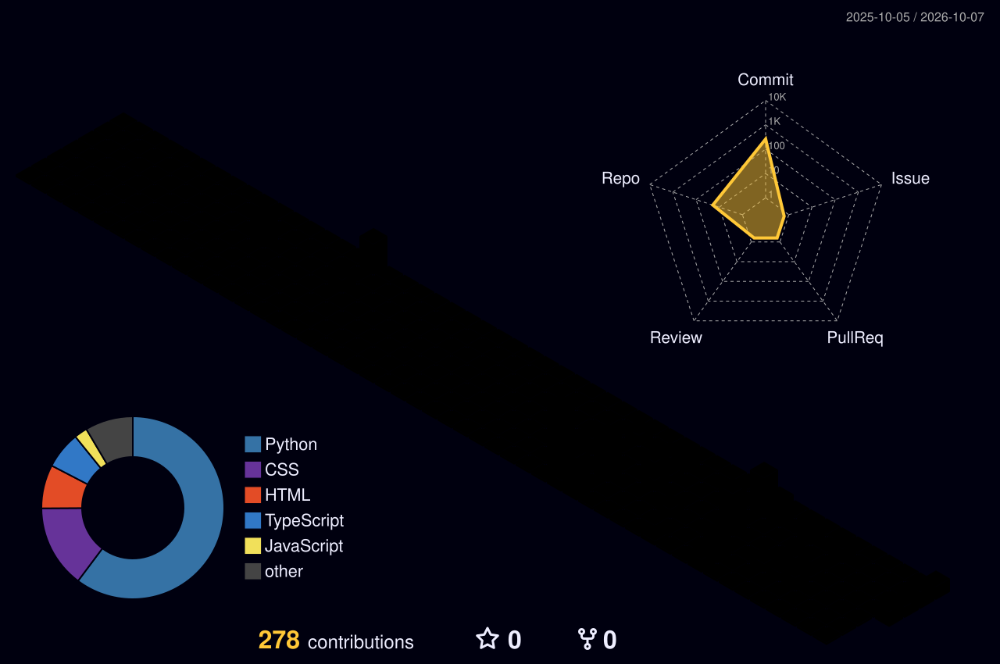

 

**AI Engineer building intelligent systems.**

I build AI-powered applications, machine learning systems, and production-ready APIs — from experimentation to deployment.

 

  

  

 

<h2 align="center">Projects</h2>

| Project | Description | Tech |
| :-- | :-- | :-- |
| **Resume Analyzer & Career Assistant** | End-to-end AI-powered resume-to-job matching system using LLM extraction, rule-based skill matching, semantic embeddings, weighted scoring and AI resume review. | LLMs · Semantic embeddings · NLP |
| **NewsLens** | Full-stack technology news aggregation dashboard using FastAPI, Next.js, React and asynchronous Python. | FastAPI · Next.js · React · Async Python |
| **CarbonWise — Carbon Footprint Tracker** | Application that converts activity data into estimated CO₂e metrics and visualizes environmental impact. | Data visualization · Web app |
| **AI Travel Planner** | Multi-agent AI system for personalized travel planning using APIs and LLM reasoning. | Multi-agent AI · LLMs · APIs |
| **Placement Predictor** | Machine learning application for predicting placement outcomes from student-related features. | Machine Learning |
| **AI Resume Critic — Tech-Roast** | Streamlit + Gemini application for resume/job-description analysis, skill-gap identification and recruiter-style feedback. | Streamlit · Gemini · LLMs |

 

<h2 align="center">3D contribution city</h2>

 

<h2 align="center">Connect</h2>

[GitHub](https://github.com/Chittransh-89) · [LinkedIn](https://www.linkedin.com/in/chittransh-verma-525992338/) · [Portfolio](https://myportfoliio-ten.vercel.app/) · [Email](mailto:vermachittransh8@gmail.com)

Building with AI. Learning by shipping.

